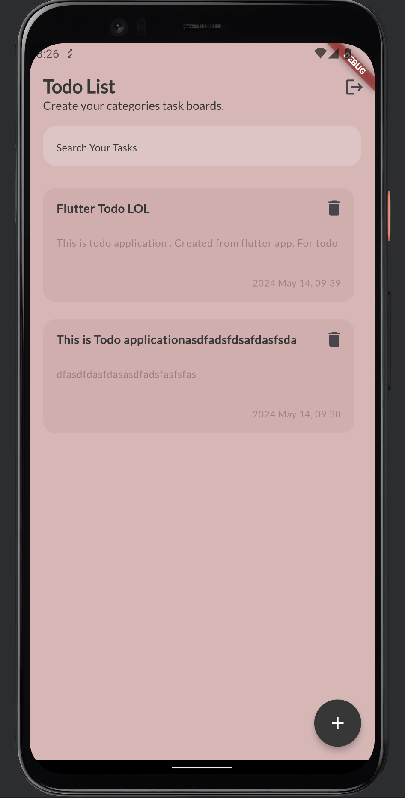

#TODO FullStack Application

This is experiment project after learnt GO Lang for Backend development. Included CRUD operations for Todo system. Mobile application is using Flutter for IOS and Android development.

⚠️_**Code are might not be perfect for flutter project coz it's took 1 day to finish**_⚠️

_Project Instructions_

Project has 2 folders, one is for server using Go lang to generate API for Frondend. Another one is Flutter for IOS and Android.

## Screenshots

##  Tech Stacks For Server
  
*   Gin for handle Http transaction [Link](https://github.com/gin-gonic/gin) 
*   Gorm for ORM database [Link](https://gorm.io)
*   JWT for handle Authentication [Link](https://github.com/golang-jwt/jwt)
*   MVC patteren 
*   etc. 

##  Tech Stacks For Server

* http for networking [Link](https://pub.dev/packages/http)
* Jsonserializable for json builder [Link](https://pub.dev/packages/json_serializable)
* Freezed for support rich feature for data model class [Link](https://pub.dev/packages/freezed)
* GetIt for dependency [Link](https://pub.dev/packages/get_it)
* Go Router for navigation [Link](https://pub.dev/packages/go_router)
* etc.

